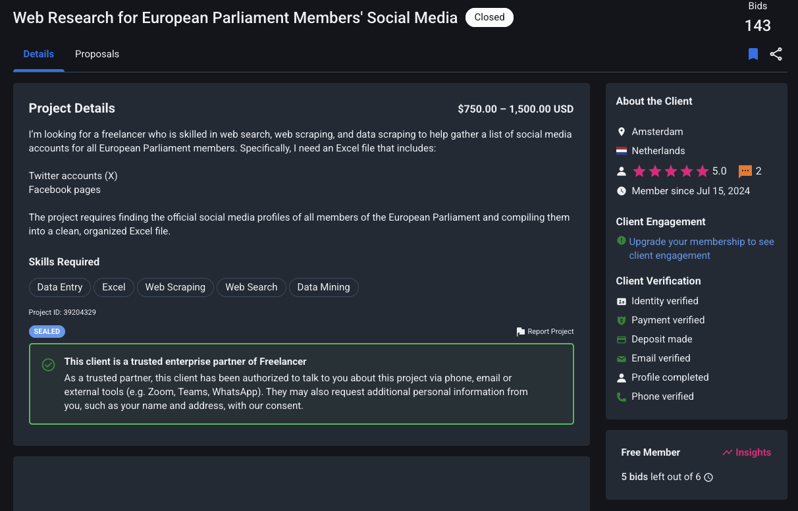
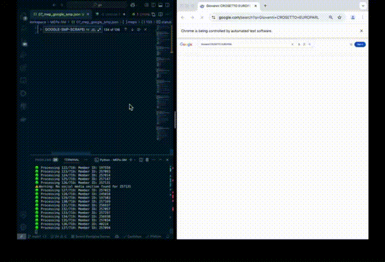

[](https://github.com/alaamjadi/Freelancer.com-Workspace)

[](https://github.com/alaamjadi/Freelancer.com-Workspace/tree/main/MEPs-SM)

# Members of the European Parliament's Social Media (MEPs-SM)

## Project Details

### Introduction

This project was undertaken to scrape publicly available social media accounts of Members of the European Parliament (MEPs) from the internet. Inspired by a project found on `freelancer.com`, this endeavor served as a valuable learning experience in web scraping. Despite bidding on the original project, it was not awarded. However, for educational purposes and to gain a first review on the platform, the project was completed independently. The goal was to gather all accessible public information, focusing primarily on social media profiles.

### Budget

750 – 1,500 USD/EUR (This reflects the budget of the original Freelancer project)

### Client Info

| Info             | Value                                                                                                     |
| ---------------- | --------------------------------------------------------------------------------------------------------- |
| **Project ID**   | [39204329](https://www.freelancer.com/projects/web-scraping/Web-Research-for-European-Parliament/details) |
| **Location**     | Amsterdam, Netherlands                                                                                    |
| **Projects**     | 2                                                                                                         |
| **Rate**         | 5/5                                                                                                       |
| **Membership**   | Jul 15, 2024                                                                                              |
| **Verification** | Identity, Payment, Email, Phone                                                                           |
| **Profile**      | Completed, Deposit made, Trusted enterprise partner of Freelancer                                         |

### Client Inquiry

The original client sought a freelancer skilled in web search, web scraping, and data scraping to compile a list of social media accounts for all European Parliament members. The specific requirement was an Excel file containing Twitter (X) accounts and Facebook pages of MEPs.

**Skills Required:** `Data Entry`, `Excel`, `Web Scraping`, `Web Search`, `Data Mining`



## Final Report

| Items         | Multiple | Missing |  Total  |
| :------------ | :------: | :-----: | :-----: |
| **Email**     |    1     |    0    |   719   |
| **Website**   |    0     |   511   |   208   |
| **Facebook**  |   112    |   107   |   612   |
| **Instagram** |    17    |   96    |   623   |
| **Twitter**   |    13    |   106   |   613   |
| **Linkedin**  |    9     |   382   |   337   |
| **Youtube**   |    19    |   387   |   332   |
| **Tiktok**    |    0     |   684   |   35    |
| **Other**     |    0     |   674   |   45    |
| **Member**    |          |         | **719** |

## Project Stages

This project involved several stages to gather and structure the MEP data:

- **Stage 1: XML to JSON**: Converting the raw MEP data from an XML file to a more manageable JSON format.

- **Stage 2: Europarl Website Scraping**: Extracting contact information, including social media links and potentially email addresses, directly from the European Parliament's website.

- **Stage 3: Google Scraping**: Utilizing Google search to find additional social media profiles that might not be directly linked on the Europarl website.

- **Stage 4: Data Cleaning:** Refining the collected data by removing redundant information, addressing potential duplications, and correcting any misidentified links.

- **Stage 5: Final Report Generation:**Generating a summary report of the collected and cleaned data.

## How to Use the Project

The project consists of Python scripts designed to automate the data collection process. To use it, follow these general steps:

1.  **Ensure you have the necessary files:** You will need the raw MEP data in an XML file `01_mep-raw.xml`. You can get this file from [europarl.europa.eu](https://www.europarl.europa.eu/meps/en/full-list/xml)

2.  **Run the XML to JSON conversion script:** Execute the script that converts the XML data to a JSON file, using `python 02_xml_to_json.py`. This will create a JSON file `03_mep-raw.json`.

3.  **Run the Europarl scraping script:** Execute the script that scrapes the European Parliament website using `python 04_europarl_scraper.py`. This script will read the JSON file from the previous step and add contact information scraped from the Europarl website, saving it to another JSON file `05_mep_europarl.json`.

4.  **Run the Google scraping script:** Execute the script that uses Google to search for MEPs' social media profiles using `python 06_google_SMP_scraper.py`. This script will read the JSON file from the Europarl scraping step and attempt to find additional social media links, saving the results to a new JSON file `07_mep_google_smp.json`.

5.  **Run the duplicate cleanup script:** Execute the script designed to identify and remove potential duplicate entries in the collected data using `python 08_duplicate_cleanup.py`. This script will likely read the JSON file from the Google scraping step and save the cleaned data to a new JSON file `09_mep_final.json`.

6.  **Run the final report generation script:** Execute the script that generates the final report (e.g., using `python 10_final_report.py`. This script will read the cleaned JSON data `09_mep_final.json` and produce a summary of the collected social media information to a new file `Report.md`.

**Note:** The specific file names used for this project is following an order. You will need to ensure that each script reads the output of the previous step as its input. Make sure to check the comments within each script for specific instructions or dependencies. You can combine all the files separate scripts into one, but I prefer it this way :-).

## Requirements

Before running the project, ensure you have the following installed:

- **Python 3**: The project is written in Python 3.
- **`xml.etree.ElementTree`**: This is a built-in Python library for parsing XML files.
- **`json`**: This is a built-in Python library for working with JSON data.
- **`os`**: This is a built-in Python library for interacting with the operating system.
- **`sys`**: This is a built-in Python library for system-specific parameters and functions.
- **`requests`**: This library is used for making HTTP requests to the Europarl website.
- **`BeautifulSoup4`**: This library is used for parsing HTML content from the Europarl website.
- **`selenium`**: This library is used for automating web browsers, necessary for the Google scraping part.
- **`webdriver-manager`**: This library helps manage browser drivers (e.g., ChromeDriver for Chrome) required by Selenium.
- **`time`**: This is a built-in Python library for time-related functions.
- **`random`**: This is a built-in Python library for generating random numbers.
- **`re`**: This is a built-in Python library for regular expressions.
- **`typing`**: This built-in Python module provides type hints.
- **`shutil`**: This is a built-in Python library for high-level file operations.

You can easily install the external libraries using pip:

```bash
python3 -m pip install --upgrade pip
pip install requests beautifulsoup4 selenium webdriver-manager
```

Refer to the comments within the scripts for specific installation instructions and troubleshooting tips, such as reinstalling packages if the browser doesn't open correctly during Google scraping.

## Considerations

### Website Structure Changes

The structure of the European Parliament website and Google search results can change. This might break the scraping scripts, requiring updates to the code, particularly the selectors used to locate information.

### Rate Limiting

Scraping websites too frequently can lead to temporary blocking of your IP address. The scripts include delays (time.sleep()) to mitigate this risk, but you might need to adjust these delays depending on the website's policies and your scraping volume.

### robots.txt

Respect the robots.txt file of the websites being scraped. This file specifies which parts of the site should not be accessed by automated bots.

### Ethical Scraping

Ensure that your scraping activities comply with the terms of service of the websites and are for legitimate and ethical purposes. Avoid overloading the servers with excessive requests.

### Handling Overwrites

The scripts include checks for existing output files and prompt the user before overwriting them, preventing accidental data loss.

### Error Handling

The scripts incorporate try-except blocks to handle potential errors during file operations, website requests, and parsing. This helps prevent the scripts from crashing and provides informative error messages.

### Why This Approach Was Chosen

This project adopted a multi-stage approach to maximize the collection of MEPs' social media information:

#### Direct Website Scraping (Europarl)

Scraping the European Parliament website directly is the most reliable way to obtain official contact information provided by the MEPs themselves.

#### Google Search

Utilizing Google search serves as a secondary method to discover social media profiles that might not be explicitly linked on the official website but are publicly available. Google's advanced indexing capabilities can uncover a broader range of online presences.

#### XML to JSON Conversion

Converting the initial XML data to JSON simplifies data manipulation and integration in subsequent scraping stages. JSON is a widely used and easily parsable data format in web development and data processing.

#### Modular Design

Breaking the project into separate scripts for XML conversion, Europarl scraping, and Google scraping allows for better organization, easier debugging, and potential reuse of individual components.

### How to Fix Possible Errors

During the execution of the scripts, you might encounter various errors. Here are some common issues and how to address them:

#### FileNotFoundError

This error indicates that a specified file (e.g., the input XML or JSON file) does not exist. Double-check the file paths in your script and ensure the files are in the correct locations.

#### ET.ParseError

This error occurs when the XML file is not well-formed or cannot be parsed correctly. Verify the integrity of your XML file.

#### requests.exceptions.RequestException

This family of errors arises from issues with making HTTP requests (e.g., network problems, website down, or being blocked). Ensure you have a stable internet connection and consider increasing the delay between requests. You might also need to investigate if your IP address has been temporarily blocked. It is suggested to use a VPN service.

#### TimeoutException (Selenium)

This error happens when Selenium waits for an element to appear on the page for longer than the specified timeout. This could indicate a slow internet connection or changes in the website structure or no links are available to collect. You might need to increase the timeout value or update the selectors.

#### NoSuchElementException (Selenium)

This error occurs when Selenium cannot find an element on the webpage using the provided selector. This is often due to changes in the website's HTML structure. Inspect the webpage's source code and update the selectors accordingly.

#### Browser Doesn't Open (Selenium)

As noted in the requirements section, if you encounter issues with the browser not opening, try uninstalling and reinstalling the selenium and webdriver-manager packages.

To uninstall and reinstall `selenium`:

```bash
pip uninstall selenium
python3 -m pip uninstall selenium
pip3 uninstall selenium
python3 -c "import selenium; print(selenium.__version__)"
rm -rf ~/Library/Python/*/lib/python*/site-packages/selenium*

python3 -m pip install --upgrade pip
pip3 install selenium
python3 -c "import selenium; print(selenium.__version__)"
```

To uninstall and reinstall `webdriver-manager`:

```bash
pip uninstall webdriver-manager
python3 -m pip uninstall webdriver-manager
pip3 uninstall webdriver-manager
python3 -c "import webdriver-manager; print(webdriver-manager.__version__)"
rm -rf ~/Library/Python/*/lib/python*/site-packages/webdriver-manager*

pip3 install webdriver-manager
python3 -m pip install webdriver-manager
python3 -c "import webdriver_manager; print('webdriver_manager is installed correctly')"
```

#### JSONDecodeError

This error occurs when trying to load data from a JSON file that is not properly formatted. Ensure your JSON files are valid.
When encountering errors, carefully read the error message and traceback to understand the cause. Inspect the relevant parts of the code and the structure of the websites you are scraping.

### JSON Structure

The project uses JSON files to store and exchange MEP data between different stages. The general structure of the JSON data is as follows:

```JSON
{
  "meps": [
    {
      "id": "EP-ID",
      "fullName": "Member's Full Name",
      "country": "Country",
      "politicalGroup": "Political Group",
      "nationalPoliticalGroup": "National Political Group",
      "status": "Current Processing Status (e.g., XML2JSON, EUROPARL-SCRAPED, EUROPARL-NOLINK, GOOGLE-SMP-SCRAPED, GOOGLE-SMP-NOLINK)",
      "contact": {
        "email": [
          "email1@example.com",
          "email2@example.com"
        ],
        "website": [
          "https://www.personal-website.eu",
          "http://another-website.com"
        ],
        "facebook": [
          "https://www.facebook.com/...",
          "https://fb.com/..."
        ],
        "instagram": [
          "https://www.instagram.com/..."
        ],
        "twitter": [
          "https://twitter.com/...",
          "https://x.com/..."
        ],
        "linkedin": [
          "https://www.linkedin.com/in/..."
        ],
        "youtube": [
          "https://www.youtube.com/@...",
          "https://youtu.be/..."
        ],
        "tiktok": [
          "https://www.tiktok.com/@..."
        ],
        "other": [
          "https://some-other-platform.example.org"
        ]
      }
    },
    // ... more MEP objects
  ]
}
```

Each MEP is represented as an object with basic information (id, fullName, country, politicalGroup, nationalPoliticalGroup, status) and a contact object. The contact object contains lists of different types of contact information found for the MEP, such as email addresses, websites, and social media links. The status field tracks the progress of each MEP through the scraping process.

### Selectors

The project utilizes CSS selectors to locate specific elements on web pages:

#### Europarl Website

The Europarl scraping script uses BeautifulSoup with CSS selectors to find the div element containing social media links (class `erpl_social-share-horizontal`) and then extracts the href attributes from the \<a\> tags within that div.

#### Google Search Results

The Google scraping script uses Selenium with CSS selectors to target the new social media section on Google search results pages. Specifically, it looks for a div with the data-attrid attribute set to `kc:/common/topic:social media presence`. It then finds g-link elements within this section and extracts the href from the nested \<a\> tags.

#### Selector Map

Additionally, a `SELECTOR_MAP` dictionary is used in both the Europarl and Google scraping scripts to categorize scraped URLs based on their domain. This map associates domain names (e.g., "facebook.com", "twitter.com") with corresponding categories (e.g., "facebook", "twitter").

```json
SELECTOR_MAP = {
    "facebook.com": "facebook",
    "fb.com": "facebook",
    "instagram.com": "instagram",
    "twitter.com": "twitter",
    "x.com": "twitter",
    "linkedin.com": "linkedin",
    "youtube.com": "youtube",
    "youtu.be": "youtube",
    "tiktok.com": "tiktok"
}
```

### Query Structure (Google Scraping)

The Google scraping script constructs search queries based on the MEP's full name + EUROPARL string. The primary query structure used is:
`{member['fullName']} EUROPARL`

For example, if an MEP's full name is "John Doe", the Google search query would be "John Doe EUROPARL". This query is designed to focus the search results on information related to the MEP within the context of the European Parliament, increasing the likelihood of finding their official social media profiles.

### Why a Delay Was Added

Delays are intentionally added within the scraping loops in both the Europarl and Google scraping scripts using the time.sleep() function. These delays serve several crucial purposes:

#### Respecting Website Limits

Sending too many requests to a website in a short period can overload its servers and may be interpreted as malicious activity. Delays help to space out the requests, reducing the burden on the target websites.

#### Preventing Blocking

Websites often have mechanisms to detect and block automated scraping activity. By introducing delays, the scripts mimic more human-like browsing behavior, making it less likely for the scraping process to be blocked by security systems.

#### Allowing Page Loading

In the Google scraping script, a short delay is added after scrolling an element into view using JavaScript (`time.sleep(0.3)`) to allow the page to fully render before attempting to extract information.

#### Passing Google Agreements and Captchas

The Google scraping script includes an initial longer delay (`time.sleep(10)`) to provide time for the user to manually interact with the browser if needed, such as accepting Google's terms or solving a CAPTCHA.

The delay values (e.g., `time.sleep(random.uniform(6, 8))` seconds for Europarl and `time.sleep(random.uniform(6.5, 10.8))` seconds for Google) are chosen to balance the need for efficient scraping with the importance of being respectful and avoiding detection by anti-scraping measures. The use of random delays further helps to avoid predictable patterns in the requests.

## Demo

Want to see the script in action? Here's a quick demo of the Google scraper`06_google_SMP_scraper.py`:



## ⚠️ **Important Disclaimer**

🚨 **USE AT YOUR OWN RISK!** 🚨

- I did not validate any of the collected information, but you can do it. There are many OSINT tools, AI tools that could be used for this project but I didn't do it.
- You might violate some **Terms of Service** please check it on your own!
- Repeated automated actions **may result in account restrictions, forced logouts, or bans**.
- **The script includes delays** to reduce detection, but **no guarantees** can be made.
- **I am not responsible** for any issues, including **account bans** or **data loss**.

## 📝 **License**

This project is licensed under the **MIT License**.  
See the [`LICENSE`](LICENSE) file for more details.

---

## 📫 **Contributing**

Contributions, bug reports, and improvements are welcome!

- Fork the repository
- Submit a **Pull Request (PR)**
- Report issues in the **Issues tab**

---

## ⭐ **Support**

If you find this script useful, consider giving it a **star ⭐** on GitHub!

---

👨‍💻 **Developed by lvl-4.com** 🚀  
Made with ❤️ and Python3 to help!

🌍 Visit my **[Website](https://lvl-4.com/)**
